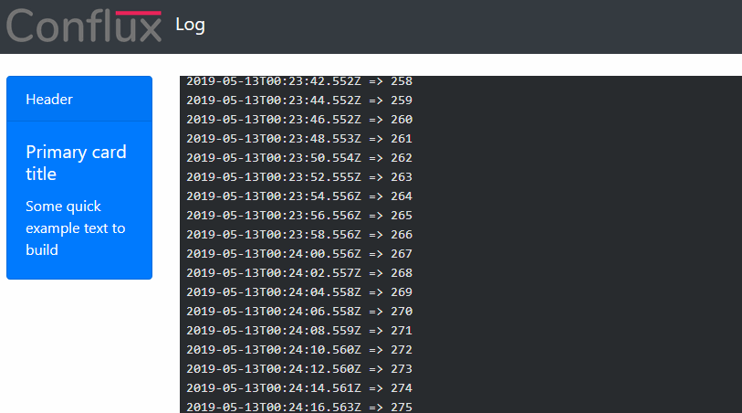

# Socket-Logger

Service to live reading of a txt file.
We needed a solution to share our log of a service without giving access to our server. This was my aproach.



## Instalation

Install dependencies on both folders, root folder and **gui** folder (which contains the React interface)

```
npm install
```

## Development

We have to start both out main folder and **gui** folder and start using

```
npm start
```

## Production

We have to build our React site executing build on the **gui** folder

```
npm run build
```

Start the server on the main folder with **start**

```
npm start
```
